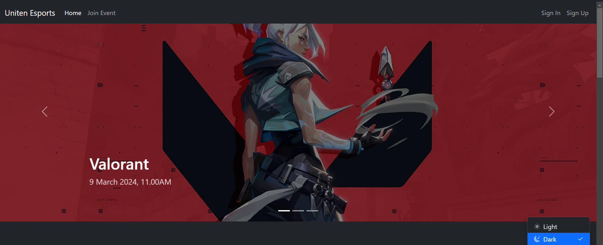
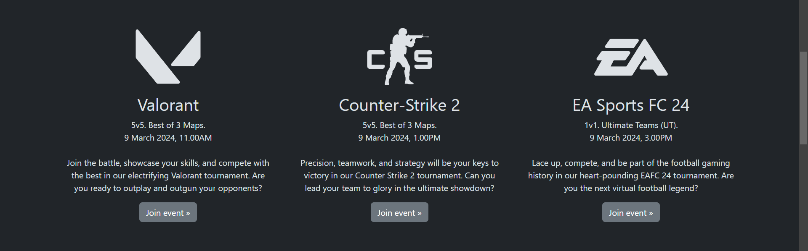
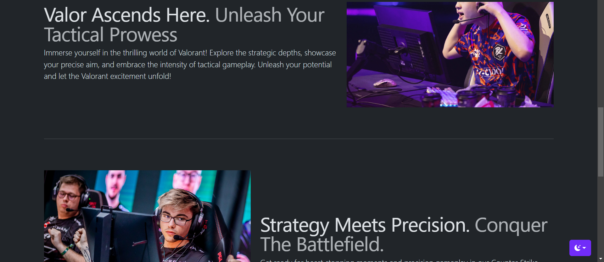
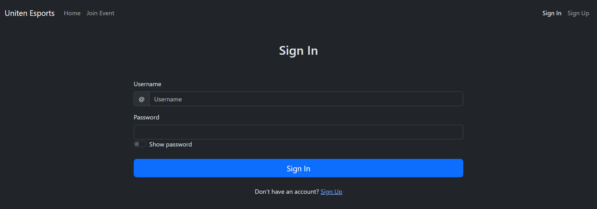
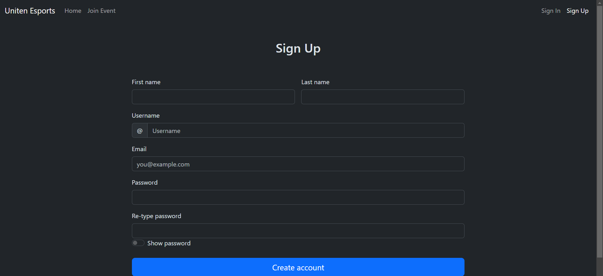
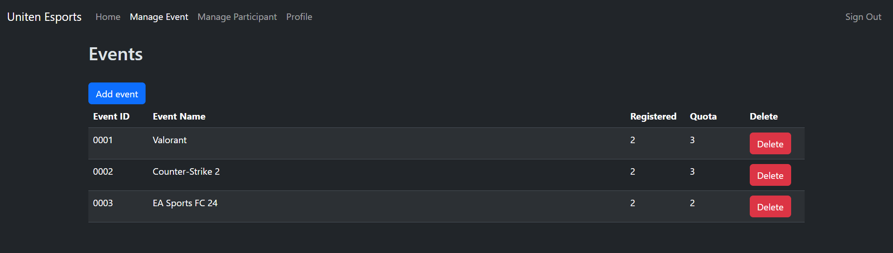
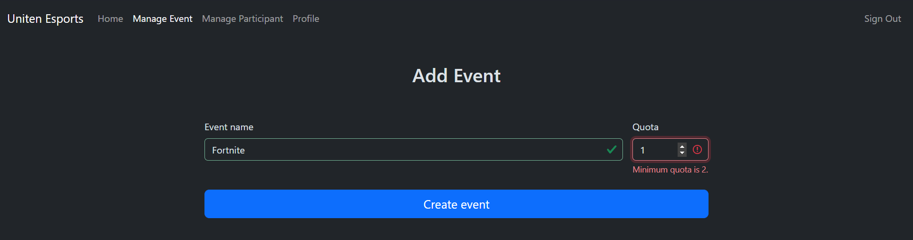
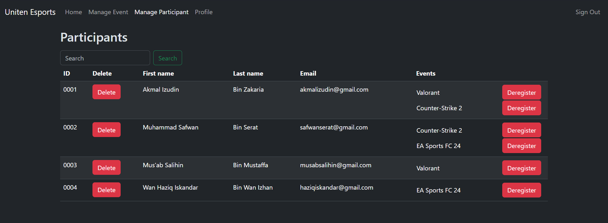
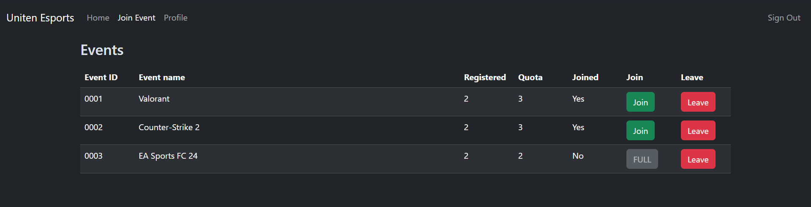
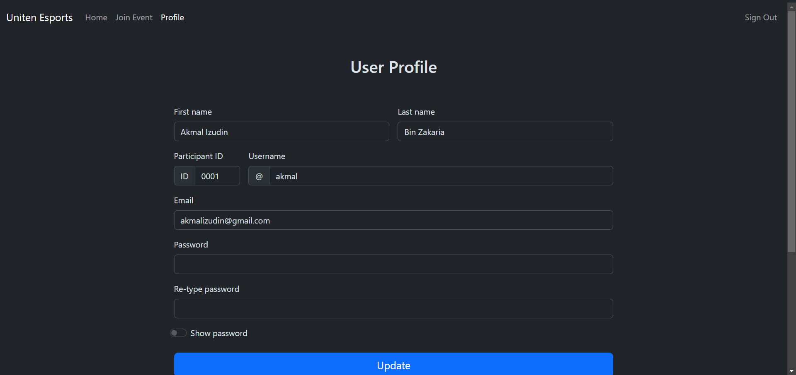

# Esports Tournament Management System

## 1.0 Setup

1. Clone repository `git clone https://github.com/fathulfahmy/event-management.git` in `htdocs`(XAMPP) or `www`(WAMPP)
1. Open PhpMyAdmin
1. Import database `event-management/assets/phpmyadmin/esportsdb.sql`

## 2.0 Testing

1. Start server
1. Open `localhost/event-management/home`

### 2.1 Admin

| Username       | Password |
| -------------- | -------- |
| unitenesports1 | Admin123 |
| unitenesports2 | Admin123 |

### 2.2 Participant

| Username | Password  |
| -------- | --------- |
| akmal    | Akmal123  |
| safwan   | Safwan123 |
| musab    | Musab123  |
| haziq    | Haziq123  |

## 3.0 Screenshots

### 3.1 General

_Homepage_

_Sign in_

_Sign up_

### 3.2 Admin

_View, add, delete event_

_View, deregister, delete participant_

### 3.3 Participant

_View, join, leave event_

_Edit profile_
