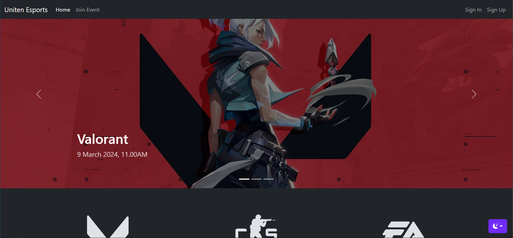

<a id="readme-top"></a>

<!-- PROJECT SHIELDS -->

[![Contributors][contributors-shield]][contributors-url]
[![Forks][forks-shield]][forks-url]
[![Stargazers][stars-shield]][stars-url]
[![Issues][issues-shield]][issues-url]
[![MIT License][license-shield]][license-url]
[![LinkedIn][linkedin-shield]][linkedin-url]

<!-- PROJECT LOGO -->
<br />

<div align="center">
  <h3 align="center">Event Management System</h3>

  <p align="center">
    A platform where users can exchange services for other services, cash, or both.
    <br />
    <br />
    <a href="https://github.com/fathulfahmy/event-management-system/issues/new?labels=bug&template=bug-report---.md">Report Bug</a>
    &middot;
    <a href="https://github.com/fathulfahmy/event-management-system/issues/new?labels=enhancement&template=feature-request---.md">Request Feature</a>
  </p>
</div>

<!-- TABLE OF CONTENTS -->

## Table of Contents

<ol>
  <li>
    <a href="#about-the-project">About The Project</a>
    <ul>
      <li><a href="#built-with">Built With</a></li>
    </ul>
  </li>
  <li>
    <a href="#getting-started">Getting Started</a>
    <ul>
      <li><a href="#prerequisites">Prerequisites</a></li>
      <li><a href="#installation">Installation</a></li>
    </ul>
  </li>
  <li><a href="#demo">Demo</a></li>
  <li><a href="#contributing">Contributing</a></li>
  <li><a href="#license">License</a></li>
  <li><a href="#contact">Contact</a></li>
  <li><a href="#acknowledgments">Acknowledgments</a></li>
</ol>

<!-- ABOUT THE PROJECT -->

## About The Project

![product-screenshot]

Developed a web-based system to manage multiple events. Features include landing page, user profile, event registration, user and data management admin panel. Built with PHP, HTML, and CSS for user registration website and admin website.

<p align="right">(<a href="#readme-top">back to top</a>)</p>

### Built With

- ![php-badge]
- ![html-badge]
- ![css-badge]
- ![bootstrap-badge]

<p align="right">(<a href="#readme-top">back to top</a>)</p>

<!-- GETTING STARTED -->

## Getting Started

### Prerequisites

- PHP
- XAMPP
- Visual Studio Code

### Installation

1. Clone the repository
   ```sh
   git clone https://github.com/fathulfahmy/event-management-system.git
   ```
2. Navigate to project directory
   ```sh
   cd event-management-system
   ```
3. Change git remote url
   ```sh
   git remote set-url origin fathulfahmy/event-management-system
   git remote -v # confirm the changes
   ```
4. Import database schema
   ```sh
   mysql -u your_user -p your_database < database/schema.sql
   ```
5. Start server
   ```sh
   php -S localhost:8000
   ```

<p align="right">(<a href="#readme-top">back to top</a>)</p>

<!-- DEMO EXAMPLES -->

## Demo

<table>
   <tr>
      <td></td>
      <td></td>
   </tr>
   <tr>
      <td>Splash</td>
      <td>Splash (cont.)</td>
   </tr>
   <tr>
      <td></td>
      <td></td>
   </tr>
   <tr>
      <td>Splash (cont.)</td>
      <td>Authorization</td>
   </tr>
   <tr>
      <td></td>
      <td></td>
   </tr>
   <tr>
      <td>Sign In</td>
      <td>Join Event</td>
   </tr>
   <tr>
      <td></td>
      <td></td>
   </tr>
   <tr>
      <td>Profile</td>
      <td>Manage Events</td>
   </tr>
   <tr>
      <td></td>
      <td></td>
   </tr>
   <tr>
      <td>Add Event</td>
      <td>Manage Participant</td>
   </tr>
</table>

<p align="right">(<a href="#readme-top">back to top</a>)</p>

<!-- CONTRIBUTING -->

## Contributing

Contributions are what make the open source community such an amazing place to learn, inspire, and create. Any contributions you make are **greatly appreciated**.

If you have a suggestion that would make this better, please fork the repo and create a pull request. You can also simply open an issue with the tag "enhancement".
Don't forget to give the project a star! Thanks again!

1. Fork the Project
2. Create your Feature Branch (`git checkout -b feature/amazing-feature`)
3. Commit your Changes (`git commit -m 'feat: add amazing feature'`)
4. Push to the Branch (`git push origin feature/amazing-feature`)
5. Open a Pull Request

### Top contributors

<a href="https://github.com/fathulfahmy/event-management-system/graphs/contributors">
  
</a>

<p align="right">(<a href="#readme-top">back to top</a>)</p>

<!-- LICENSE -->

## License

Distributed under the MIT License. See `LICENSE.md` for more information.

<p align="right">(<a href="#readme-top">back to top</a>)</p>

<!-- CONTACT -->

## Contact

Fathul Fahmy - [@fathulfahmy](https://linkedin.com/in/fathulfahmy) - mfathulfahmy@gmail.com

Project Link: [https://github.com/fathulfahmy/event-management-system](https://github.com/fathulfahmy/event-management-system)

<p align="right">(<a href="#readme-top">back to top</a>)</p>

<!-- ACKNOWLEDGMENTS -->

## Acknowledgments

- [Bootstrap](https://getbootstrap.com/docs/4.0/examples/)
- [Best-README-Template](https://github.com/othneildrew/Best-README-Template)

<p align="right">(<a href="#readme-top">back to top</a>)</p>

<!-- MARKDOWN LINKS & IMAGES -->
<!-- https://www.markdownguide.org/basic-syntax/#reference-style-links -->

[contributors-shield]: https://img.shields.io/github/contributors/fathulfahmy/event-management-system.svg?style=for-the-badge
[contributors-url]: https://github.com/fathulfahmy/event-management-system/graphs/contributors
[forks-shield]: https://img.shields.io/github/forks/fathulfahmy/event-management-system.svg?style=for-the-badge
[forks-url]: https://github.com/fathulfahmy/event-management-system/network/members
[stars-shield]: https://img.shields.io/github/stars/fathulfahmy/event-management-system.svg?style=for-the-badge
[stars-url]: https://github.com/fathulfahmy/event-management-system/stargazers
[issues-shield]: https://img.shields.io/github/issues/fathulfahmy/event-management-system.svg?style=for-the-badge
[issues-url]: https://github.com/fathulfahmy/event-management-system/issues
[license-shield]: https://img.shields.io/github/license/fathulfahmy/event-management-system.svg?style=for-the-badge
[license-url]: https://github.com/fathulfahmy/event-management-system/blob/main/LICENSE.md
[linkedin-shield]: https://img.shields.io/badge/-LinkedIn-black.svg?style=for-the-badge&logo=linkedin&colorB=555
[linkedin-url]: https://linkedin.com/in/fathulfahmy
[product-screenshot]: docs/banner.png
[php-badge]: https://img.shields.io/badge/PHP-777BB4?logo=php&logoColor=white&style=for-the-badge
[html-badge]: https://img.shields.io/badge/HTML5-E34F26?logo=html5&logoColor=white&style=for-the-badge
[css-badge]: https://img.shields.io/badge/CSS3-1572B6?logo=css3&logoColor=white&style=for-the-badge
[bootstrap-badge]: https://img.shields.io/badge/Bootstrap-7952B3?logo=bootstrap&logoColor=white&style=for-the-badge
